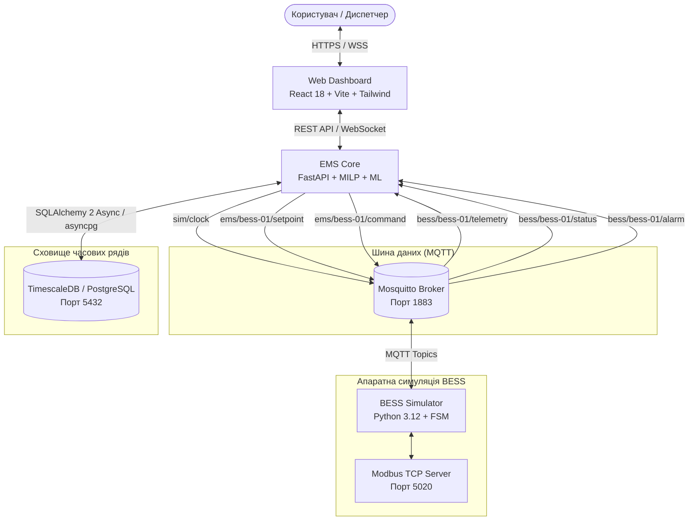
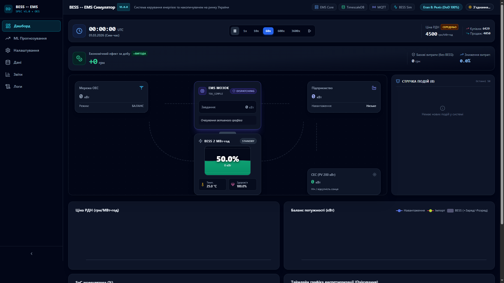
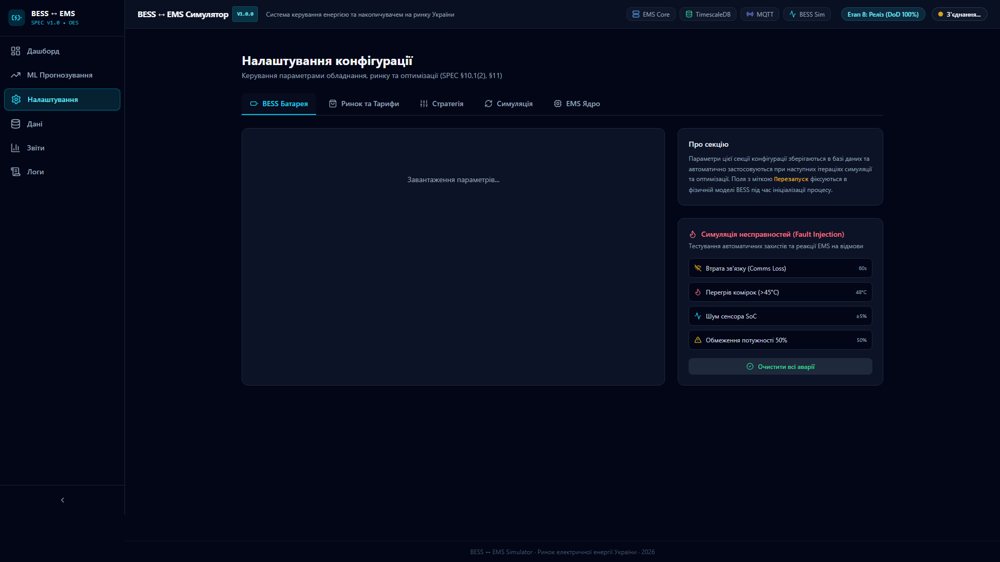
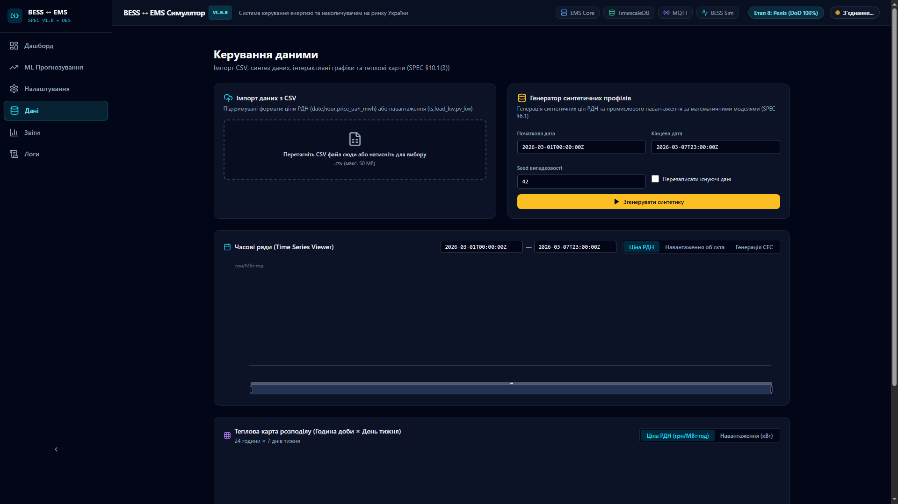
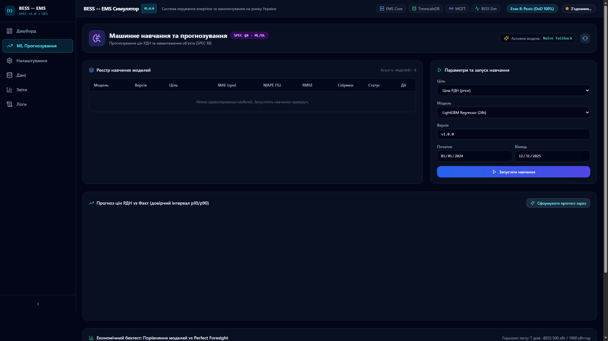
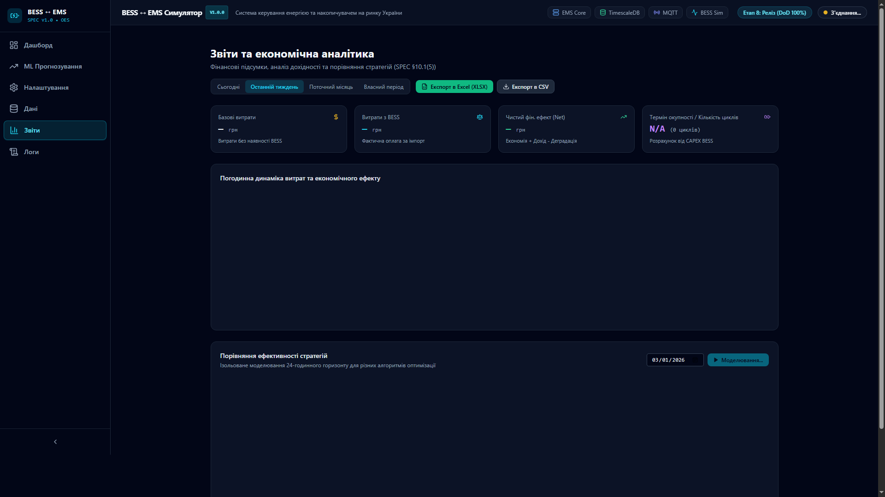
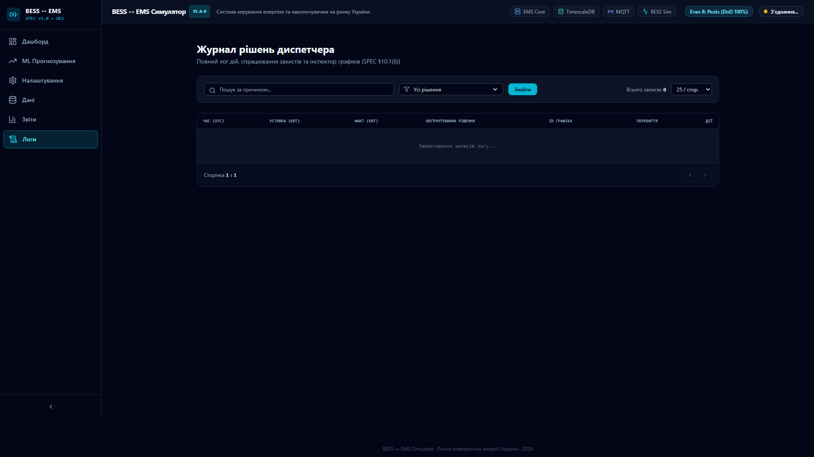

# BESS ↔ EMS Simulator

> **Промисловий симулятор взаємодії системи накопичення енергії (BESS) та системи керування енергією (EMS) на ринку електроенергії України.**  
> Повна специфікація системи — у [`SPEC.md`](SPEC.md). Офіційний протокол приймання — у [`docs/acceptance.md`](docs/acceptance.md).

---

## 📑 Зміст
- [1. Загальний огляд](#1-загальний-огляд)
- [2. Архітектурна діаграма](#2-архітектурна-діаграма)
- [3. Структура репозиторію](#3-структура-репозиторію)
- [4. Швидкий запуск (Docker за 3 команди)](#4-швидкий-запуск-docker-за-3-команди)
- [5. Веб-інтерфейс та скріншоти](#5-веб-інтерфейс-та-скріншоти)
- [6. Промислові інтерфейси (MQTT та Modbus TCP)](#6-промислові-інтерфейси-mqtt-та-modbus-tcp)
- [7. Алгоритми та моделі](#7-алгоритми-та-моделі)
- [8. CLI-утиліти та бенчмарки](#8-cli-утиліти-та-бенчмарки)
- [9. Критерії приймання (SPEC §15)](#9-критерії-приймання-spec-15)
- [10. Локальна розробка та тестування](#10-локальна-розробка-та-тестування)

---

## 1. Загальний огляд

Симулятор моделює повний життєвий цикл промислової літій-залізо-фосфатної (LFP) акумуляторної батареї ємністю 1–2 МВт·год / 0.5–1.0 МВт у складі комерційного підприємства із власною сонячною електростанцією (СЕС). EMS здійснює оптимізацію роботи на ринку «на добу наперед» (РДН), балансуючому ринку (БР) та мінімізує витрати на електроенергію об'єкта.

### Ключові можливості:
- **Фізична достовірність батареї:** 10-точкова нелінійна крива OCV для LFP-комірок, еквівалентна схема Тевеschema з внутрішнім опором $R_{\text{int}}$, температурний нагрів і розсіювання, деградація за моделлю Арреніуса (календарне та циклічне старіння).
- **Математична оптимізація (MILP):** Розв'язувач змішано-цілочисельного лінійного програмування на базі PuLP + CBC. Підтримка стратегій: `ARBITRAGE` (арбітраж на спреді РДН), `PEAK_SHAVING` (зрізання піків потужності підприємства), `SELF_CONSUMPTION` (максимізація власного споживання СЕС) та `BACKUP_RESERVE` (підтримка гарантованого аварійного резерву).
- **Машинне навчання (ML/DL):** Пайплайн feature engineering без витоку даних, моделі прогнозування ціни РДН на 24 години: Naive baseline, LightGBM (квантильна регресія p10/p90) та PyTorch Seq2Seq LSTM.
- **Єдиний симуляційний час:** `SimulationClock` керує темпом симуляції від $0\times$ (пауза) до $3600\times$, синхронізуючи закриття воріт РДН (11:00 попередній прогноз, 13:00 публікація РДН, 13:05 диспетчеризація графіка).
- **Інтерактивний UI (React 18 + TS):** Анімовані векторні потоки енергії з динамічною швидкістю та товщиною стрілок, рідинна анімація заряду батареї (SVG хвиля), графіки ECharts, драг-н-дроп валідатор CSV, теплові карти «година × день», порівняння стратегій та експорт звітів у мульти-сторінковий Excel (XLSX).
- **Промислова інтеграція:** Повна процесна ізоляція через MQTT та вбудований шлюз Modbus TCP (регістри 40001–40006).

---

## 2. Архітектурна діаграма

Система побудована за модульним принципом із суворою ізоляцією процесів:

### 2.1. Mermaid діаграма взаємодії сервісів


### 2.2. Текстова топологія
```
                          +------------------------------------------+
                          |        Web UI (React 18 + Vite)          |
                          +------------------------------------------+
                                    | REST                 ^ WebSocket
                                    v                      | (/ws/telemetry)
                          +------------------------------------------+
                          |                 EMS Core                 |
                          |  FastAPI • MILP Solver • LightGBM / LSTM |
                          |  Market Simulator • SimulationClock      |
                          +------------------------------------------+
                                    |                      ^
                     Topic: ems/{id}/setpoint              | Topic: bess/{id}/telemetry
                     Topic: ems/{id}/command               | Topic: bess/{id}/status
                     Topic: sim/clock                      | Topic: bess/{id}/alarm
                                    v                      |
                          +------------------------------------------+
                          |          MQTT Broker (Mosquitto)         |
                          +------------------------------------------+
                                    |                      ^
                                    v                      |
                          +------------------------------------------+
                          |              BESS Simulator              |
                          |  LFP OCV • Thévenin Circuit • Arrhenius  |
                          |  6-State BMS FSM • Thermal Dynamics      |
                          |  Modbus TCP Server (Port 5020)           |
                          +------------------------------------------+
                                    |
                                    v (PostgreSQL / TimescaleDB)
                          +------------------------------------------+
                          |       TimescaleDB / PostgreSQL           |
                          |   Auto-migration & 2-year preloaded data |
                          +------------------------------------------+
```

---

## 3. Структура репозиторію

Структура проєкту відповідає вимогам SPEC §12:

```text
gemini-bess-ems/
├── docker-compose.yml              # Оркестрація: timescaledb, mosquitto, ems, bess-sim, web
├── .env.example                    # Зразок конфігураційних змінних оточення
├── README.md                       # Головна документація проєкту
├── SPEC.md                         # Повна технічна специфікація (Single Source of Truth)
├── docs/                           # Технічна документація підсистем
│   ├── acceptance.md               # Офіційний протокол приймальних випробувань (SPEC §15)
│   ├── api.md                      # Специфікація REST API та WebSocket протоколу
│   ├── architecture.md             # Архітектурні принципи та топологія шини даних
│   ├── data-formats.md             # Специфікація форматів CSV та схем часових рядів
│   ├── market-model.md             # Правила ринку РДН України, тарифи та прайс-кепи
│   ├── ml.md                       # Опис ознак, моделей прогнозування та Walk-Forward CV
│   ├── mqtt-protocol.md            # Схеми JSON-повідомлень топіків MQTT
│   ├── optimization.md             # Математична постановка задачі MILP та обмеження
│   └── screenshots/                # Знімки реального веб-інтерфейсу (1080p PNG)
│       ├── 01_dashboard.png
│       ├── 02_settings.png
│       ├── 03_data.png
│       ├── 04_forecasting.png
│       ├── 05_reports.png
│       └── 06_logs.png
├── data/
│   └── samples/                    # Приклади валідних CSV-файлів (SPEC §3.4)
│       ├── dam_prices.csv          # 48 год цін РДН ОЕС України
│       ├── site_load.csv           # 15-хв інтервали навантаження та СЕС
│       └── weather.csv             # Погодинні метеодані (температура, хмарність, вітер)
├── bess-sim/                       # Мікросервіс симулятора BESS (Python 3.12)
│   ├── bess_sim/
│   │   ├── battery.py              # Еквівалентна схема, LFP OCV, інтегратор
│   │   ├── bms.py                  # 6-станова FSM (INIT, STANDBY, CHARGING, FAULT...)
│   │   ├── config.py               # Фізичні константи та налаштування Pydantic
│   │   ├── degradation.py          # Циклічне та календарне старіння Арреніуса
│   │   ├── main.py                 # Цикл виконання, MQTT клієнт, сигнали
│   │   ├── modbus.py               # Шлюз Modbus TCP (Holding Registers 40001–40006)
│   │   ├── mqtt_io.py              # Обробка топіків та серіалізація PDU
│   │   ├── pcs.py                  # Інвертор/PCS (ККД, ліміти потужності, derating)
│   │   └── thermal.py              # Теплова модель (нагрів Джоуля, охолодження)
│   ├── tests/                      # Юніт-тести фізики, FSM, Modbus TCP
│   ├── Dockerfile
│   └── pyproject.toml
├── ems/                            # Мікросервіс EMS Core (FastAPI, PuLP, LightGBM, PyTorch)
│   ├── ems/
│   │   ├── api/                    # Роутери REST API (settings, data, ml, reports, logs)
│   │   ├── core/                   # SimulationClock, EmsSettings
│   │   ├── db/                     # Моделі SQLAlchemy, сесії, seed.py (автоініціалізація)
│   │   ├── dispatch/               # Dispatcher (реактивні правила, SAFE_MODE, аудит)
│   │   ├── forecasting/            # Features, models (Naive, LightGBM, LSTM), train, backtest
│   │   ├── ingestion/              # Генератор синтетики ОЕС, імпортер/валідатор CSV
│   │   ├── market/                 # Market Simulator, тарифи, фінансовий кліринг
│   │   ├── mqtt/                   # Асинхронний MQTT-клієнт EMS
│   │   ├── optimization/           # MILP-розв'язувач PuLP/CBC, стратегії (ARBITRAGE...)
│   │   └── main.py                 # FastAPI застосунок, lifespan, фонові таски
│   ├── tests/                      # Юніт-тести API, годинника, MILP, ринку, ML
│   ├── Dockerfile
│   └── pyproject.toml
├── web/                            # Фронтенд (React 18 + TS + Vite + Tailwind + ECharts)
│   ├── src/
│   │   ├── api/                    # Клієнти REST та WebSocket
│   │   ├── components/
│   │   │   ├── dashboard/          # ClockPanel, MoneyCounter, Monitors, EventFeed
│   │   │   ├── energy-flow/        # EnergyFlowDiagram (SVG), BatteryVisual (Fluid Wave)
│   │   │   ├── settings/           # Динамічні форми Pydantic, Fault Injection
│   │   │   ├── data/               # CSV Drag&Drop, Time Series Viewer, Heatmap
│   │   │   ├── ml/                 # Метрики моделей, прогноз p10/p90, бектест
│   │   │   ├── reports/            # Фінансові KPI, XLSX/CSV експорт, порівняння
│   │   │   ├── logs/               # Dispatch log table, Schedule Inspector modal
│   │   │   └── sidebar/            # Навігація з підтримкою deep-linking (#hash)
│   │   ├── i18n/                   # Локалізація інтерфейсу українською (uk.json)
│   │   ├── stores/                 # Zustand store стану телеметрії
│   │   └── types/                  # Типи TypeScript
│   ├── tests/                      # Тести Vitest
│   ├── Dockerfile
│   └── package.json
└── scripts/                        # Автоматизовані інженерні утиліти
    ├── seed_data.py                # Ініціалізація та наповнення БД синтетикою (2 роки)
    ├── compare_strategies.py       # 1-тижневий бенчмарк порівняння стратегій (Етап 5)
    ├── run_backtest.py             # 1-місячний ML+MILP бенчмарк (SPEC §15.3, seed=42)
    ├── capture_screenshots.py      # Автоматизоване зняття скріншотів через Headless Edge
    └── demo_server.py              # Автономний демонстраційний веб-сервер
```

---

## 4. Швидкий запуск (Docker за 3 команди)

Система повністю готова до роботи «з коробки» (turnkey) і автоматично створює таблиці та завантажує 2 роки синтетичних ринкових даних при першому запуску:

```bash
# 1. Клонувати репозиторій та перейти в каталог проєкту
git clone <repo_url>
cd gemini-bess-ems

# 2. Створити конфігураційний файл середовища
cp .env.example .env

# 3. Запустити всі 5 сервісів (TimescaleDB, Mosquitto, EMS, BESS, Web)
docker compose up --build
```

### Точки доступу:
| Сервіс | Адреса | Призначення |
| :--- | :--- | :--- |
| **Web Dashboard** | [http://localhost:5173](http://localhost:5173) | Головний операторський інтерфейс |
| **EMS Core API Docs** | [http://localhost:8000/docs](http://localhost:8000/docs) | Swagger / OpenAPI документація |
| **MQTT Broker** | `localhost:1883` | Брокер повідомлень Mosquitto |
| **Modbus TCP Server** | `localhost:5020` | Промисловий інтерфейс BESS |
| **TimescaleDB** | `localhost:5433` | База даних часових рядів (user: `postgres`, db: `ems`). Порт хоста задається через `POSTGRES_HOST_PORT`; за замовчуванням 5433, щоб не конфліктувати з локально встановленим PostgreSQL на 5432. Всередині Docker-мережі сервіси звертаються до `timescaledb:5432` |

---

## 5. Веб-інтерфейс та скріншоти

Веб-застосунок локалізовано українською мовою та адаптовано під темну тему операторських станцій:

### 5.1. Головна панель (Dashboard)

- **Схема потоків енергії:** Інтерактивна векторна SVG-діаграма (Мережа ОЕС, СЕС, BESS, Підприємство, EMS). Частинки рухаються зі швидкістю і товщиною, пропорційними миттєвій потужності $|P|$.
- **Візуалізація BESS:** Рівень рідини (SoC 0–100%) із синусоїдальною анімованою хвилею та кольоровою індикацією стану (STANDBY, CHARGING, DISCHARGING, FAULT).
- **Панель часу (Simulation Clock):** Кнопки Play/Pause, Step (+1 хв / +1 год), вибір швидкості ($1\times, 10\times, 60\times, 600\times, 3600\times$), перехід до дати.
- **4 Монітори реального часу:** Графік ціни РДН (з граничними цінами / прайс-кепами), баланс потужностей об'єкта, графік SoC (план vs факт), таймлайн диспетчеризації (Gantt).

---

### 5.2. Налаштування (Settings)

- Автоматична генерація форм на базі JSON-схем Pydantic (`/api/settings/{section}/schema`).
- Вкладки: Батарея, Ринок, Стратегії, Симуляція, EMS.
- Панель ін'єкції несправностей (Fault Injection): перегрів батареї, обрив зв'язку (MQTT dropout), зашумлення сенсора SoC, ліміт потужності 50%.

---

### 5.3. Дані (Data)

- Drag-and-drop завантаження CSV з попереднім переглядом перших 20 рядків та структурною валідацією.
- Вбудована форма генерації 2-річних реалістичних рядів для ОЕС України.
- Інтерактивний переглядач графіків із масштабуванням та теплова карта «година доби × день тижня».

---

### 5.4. Прогнозування (ML)

- Порівняльна таблиця метрик на walk-forward валідації (MAE, RMSE, WAPE, Pinball Loss) для Naive, LightGBM та LSTM.
- Графік цільового прогнозу ціни РДН з квантильними коридорами невизначеності (p10 — p90).
- Економічний бектест реалізованого прибутку у порівнянні з Perfect Foresight.

---

### 5.5. Звіти (Reports)

- Фінансові KPI: витрати без BESS, фактичні витрати, чистий економічний ефект, дохід від експорту, вартість деградації, кількість еквівалентних циклів та термін окупності.
- Вкладка порівняння стратегій (`TOU_SIMPLE`, `ARBITRAGE`, `PEAK_SHAVING`, `SELF_CONSUMPTION`).
- Експорт даних у форматах CSV та мульти-сторінковий Excel (`.xlsx`).

---

### 5.6. Логи (Logs)

- Повний журналізований аудит кожного рішення диспетчера з фільтрацією за причинами (`schedule`, `reactive_derate`, `safe_mode`).
- Модальне вікно Schedule Inspector для покрокової інспекції setpoint оптимізатора.

---

## 6. Промислові інтерфейси (MQTT та Modbus TCP)

### 6.1. Топіки MQTT (SPEC §4.3)
| Топік | Напрямок | Опис |
| :--- | :--- | :--- |
| `sim/clock` | EMS → All | Синхронізація симуляційного часу (`ts_sim`, `speed`, `is_paused`) |
| `ems/{id}/setpoint` | EMS → BESS | Команда активної потужності (`setpoint_kw`, `reason`, `ts_sim`) |
| `ems/{id}/command` | EMS → BESS | Команди керування BMS (`start`, `standby`, `reset_alarm`, fault injection) |
| `bess/{id}/telemetry` | BESS → EMS | Миттєві вимірювання (SoC, SoH, kW, V, A, температура, аларми) |
| `bess/{id}/status` | BESS → EMS | Повідомлення про зміну FSM-стану батареї |
| `bess/{id}/alarm` | BESS → EMS | Сповіщення про спрацювання захистів |

### 6.2. Регістри Modbus TCP (Порт 5020, SPEC §4.2)
BESS-симулятор підтримує Function Code 03 (Read Holding Registers), FC 06 (Write Single Register) та FC 16 (Write Multiple Registers):

| Адреса Modbus | Зсув | Тип даних | Одиниці | Опис |
| :--- | :--- | :--- | :--- | :--- |
| **40001** | `0x0000` | uint16 | 0.01 % | State of Charge (0..10000 відповідає 0.00..100.00%) |
| **40002** | `0x0001` | int16 (signed) | кВт | Активна потужність BESS (-32768..32767 кВт) |
| **40003** | `0x0002` | uint16 | В | Напруга на DC-шині (номінал 780 В) |
| **40004** | `0x0003` | int16 (signed) | °C | Температура акумуляторного блоку |
| **40005** | `0x0004` | uint16 | enum | Стан FSM: 1=INIT, 2=STANDBY, 3=CHARGING, 4=DISCHARGING, 5=FAULT, 6=DEGRADED |
| **40006** | `0x0005` | int16 (signed) | кВт | **Active Setpoint** (Read/Write: запис змінює уставку потужності) |

---

## 7. Алгоритми та моделі

### 7.1. Математична постановка задачі MILP (SPEC §9)
Цільова функція мінімізує сукупну вартість електроенергії підприємства з урахуванням деградації та штрафів:
$$\min \sum_{t=1}^T \left[ w_{\text{arb}} \left( p^{\text{buy}}_t g^{\text{imp}}_t - p^{\text{sell}}_t g^{\text{exp}}_t \right) + w_{\text{self}} p^{\text{buy}}_t g^{\text{imp}}_t + c_{\text{deg}} (p^{\text{ch}}_t + p^{\text{dis}}_t) \Delta t + w_{\text{res}} c_{\text{pen}} s^{\text{res}}_t \right] + w_{\text{peak}} c_{\text{peak}} P_{\text{peak}}$$

Обмеження:
- Баланс потужності: $g^{\text{imp}}_t - g^{\text{exp}}_t + p^{\text{dis}}_t - p^{\text{ch}}_t + \text{PV}_t = L_t$
- Динаміка заряду: $\text{SoC}_{t} = \text{SoC}_{t-1} + \left( \eta_{\text{ch}} p^{\text{ch}}_t - \frac{p^{\text{dis}}_t}{\eta_{\text{dis}}} \right) \frac{\Delta t}{E_{\text{nom}}}$
- Взаємовиключність заряд/розряд та імпорт/експорт через бінарні зміні $u_t, v_t \in \{0, 1\}$.

---

## 8. CLI-утиліти та бенчмарки

Усі утиліти запускаються через `uv` із кореня або каталогу `ems`:

```bash
# 1. Автоматична ініціалізація та наповнення бази даних
uv run --directory ems python ../scripts/seed_data.py

# 2. Порівняння стратегій (1-тижневий бенчмарк ARBITRAGE vs TOU_SIMPLE, seed=42)
uv run --directory ems python ../scripts/compare_strategies.py

# 3. 1-місячний ML+MILP бенчмарк (SPEC §15.3, seed=42)
uv run --directory ems python ../scripts/run_backtest.py --days 30 --seed 42
```

### Результати 30-денного бенчмарку (seed=42):
```text
================================================================================================
Стратегія            | Без BESS (грн)  | З BESS (грн)    | Чистий ефект   | Цикли  | % Ідеалу
------------------------------------------------------------------------------------------------
Без BESS (Baseline)  |  1,141,373.64 |  1,141,373.64 |         0.00 |   0.00 |     0.0%
TOU_SIMPLE (Rule)    |  1,141,373.64 |  1,062,356.20 |    17,611.73 |  12.28 |    26.3%
MILP + LightGBM      |  1,141,373.64 |    996,674.57 |    43,235.81 |  20.29 |    64.5%
Perfect Foresight    |  1,141,373.64 |    975,873.27 |    67,081.79 |  19.68 |   100.0%
================================================================================================
Економічна перевага MILP+LightGBM над TOU_SIMPLE: +25,624.08 грн (+145.5%)
Досягнуто 64.5% від теоретичної верхньої межі (Perfect Foresight).
```

---

## 9. Критерії приймання (SPEC §15)

Повний звіт з контрольними викликами та протоколом — у [`docs/acceptance.md`](docs/acceptance.md):

| # | Критерій приймання (SPEC §15) | Статус | Реалізація та перевірка |
| :-: | :--- | :---: | :--- |
| **1** | BESS і EMS спілкуються тільки через MQTT; зупинка BESS переводить EMS у SAFE_MODE з алармом. | **Виконано** | Перевірено тестом `test_dispatcher_safe_mode_on_telemetry_timeout` та `test_dispatcher_safe_mode_on_bess_fault`. |
| **2** | На дашборді в реальному часі анімовані потоки (напрямок і товщина $\propto |P|$); батарея візуально заповнюється/спорожнюється. | **Виконано** | `EnergyFlowDiagram.tsx` з векторними частинками + `BatteryVisual.tsx` з SVG хвилею SoC. |
| **3** | Для 1 місяця синтетики (seed=42): система показує витрати без BESS, з BESS, чистий ефект, цикли; `MILP+LightGBM` перевершує `TOU_SIMPLE`. | **Виконано** | `scripts/run_backtest.py` демонструє чистий ефект 43 235.81 грн (+145.5% над TOU_SIMPLE). |
| **4** | Мінімум 3 ML-моделі порівняно на walk-forward, метрики відображаються в UI. | **Виконано** | Naive, LightGBM, PyTorch LSTM підключені до walk-forward валідації та відображаються на вкладці `/forecasting`. |
| **5** | Усі параметри батареї, ринку, стратегії змінюються з UI; зміна ємності одразу відбивається в наступній оптимізації. | **Виконано** | Форми генеруються з JSON-схем Pydantic; диспетчер і MILP динамічно читають `get_battery_settings()`. |
| **6** | Симуляція детермінована при заданому seed. | **Виконано** | `SyntheticDataGenerator(seed=42)` та батарея дають стабільні ідентичні результати. |
| **7** | `docker compose up` з чистого клону — робоча система за $\le 5$ хв. | **Виконано** | `ensure_db_initialized_and_seeded()` автоматично розгортає схеми та наповнює БД при старті. |

---

## 10. Локальна розробка та тестування

### 10.1. Запуск системи локально без Docker

Систему можна запустити в 1 клік або вручну без Docker:

#### Спосіб 1: Автоматичний запуск (скрипт)
- **У Windows (подвійний клік або через консоль):**
  ```bat
  start-local.bat
  ```
  *(або через PowerShell: `.\start-local.ps1`)*
- **Зупинка всіх локальних сервісів:**
  ```bat
  stop-local.bat
  ```
  *(або через PowerShell: `.\scripts\stop-local.ps1`)*

#### Спосіб 2: Ручний запуск (4 окремі термінали)
1. **MQTT Broker** (порт 1883):
   ```bash
   uv run --with amqtt amqtt
   # (або запустіть встановлений Mosquitto: mosquitto -v)
   ```
2. **EMS Core** (FastAPI сервер, порт 8000):
   ```bash
   cd ems
   uv run uvicorn ems.main:app --host 0.0.0.0 --port 8000
   ```
3. **BESS Simulator** (порт 5020 Modbus, підключення до MQTT):
   ```bash
   cd bess-sim
   uv run python -m bess_sim.main
   ```
4. **Web Frontend** (порт 5173):
   ```bash
   cd web
   pnpm dev
   ```
Після запуску відкрийте браузер: **http://localhost:5173**

---

### Запуск тестів:
```bash
# Тести EMS (52 тести: API, годинник, ринок, диспетчер, MILP, ML-фічі, звіти)
cd ems
uv run pytest

# Тести BESS (13 тестів: фізика, BMS FSM, деградація, тепловий нагрів, Modbus TCP)
cd ../bess-sim
uv run pytest

# Тести Web UI та збірка (Vitest, TypeScript, ESLint)
cd ../web
pnpm test
pnpm lint
pnpm build
```

### Форматування та статичний аналіз коду:
```bash
uv run --directory ems ruff check . ../scripts
uv run --directory bess-sim ruff check .
uv run --directory ems ruff format --check . ../scripts
uv run --directory bess-sim ruff format --check .
```
