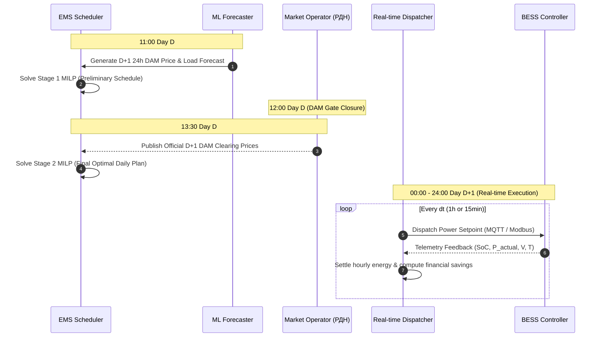

# Ukrainian Electricity Market Model & Financial Mechanics

## 1. Overview & Regulatory Alignment
The system simulates the Ukrainian electricity market operation for a non-household industrial consumer (connected to the distribution grid) operating behind-the-meter (BTM) BESS under current Ukrainian legislation and NERC (НКРЕКП) regulations (Law of Ukraine "On the Electricity Market", Market Rules, Distribution Code, Commercial Metering Code).

---

## 2. Tariff & Price Structure

### 2.1 Retail Electricity Purchase Price ($Price_{buy}$)
When energy is imported from the grid to supply site load or charge the BESS:

$$Price_{buy}(t) = \left( Price_{DAM}(t) + Tariff_{trans} + Tariff_{dist}(class) + Tariff_{supp} \right) \times (1 + Excise) \times (1 + VAT)$$

Where:
- $Price_{DAM}(t)$: Day-Ahead Market (РДН) clearing price for hour $t$ (UAH/MWh).
- $Tariff_{trans}$: Ukrenergo transmission tariff (Тариф на передачу НЕК «Укренерго»), e.g., 528.57 UAH/MWh.
- $Tariff_{dist}(class)$: DSO distribution tariff (Тариф на розподіл ОСР):
  - **Voltage Class 1** ($\ge 27.5$ kV): lower rate (e.g., 150–250 UAH/MWh).
  - **Voltage Class 2** ($< 27.5$ kV): standard industrial rate (e.g., 800–1200 UAH/MWh).
- $Tariff_{supp}$: Energy supplier commercial margin (e.g., 50–100 UAH/MWh).
- $Excise$: Excise duty on electricity (3%).
- $VAT$: Value Added Tax (20%).

### 2.2 Feed-in / Export Price ($Price_{sell}$)
When BESS or local generation discharges back into the external grid:

$$Price_{sell}(t) = Price_{DAM}(t) \times k_{export}$$

Where:
- $k_{export}$ is the net export settlement discount factor (default $0.9$, i.e. 90% of DAM price), reflecting trading service fees, imbalance risk allocations, and grid access settlement.
- Regulated tariffs (transmission, distribution, excise) are **not** paid when energy is generated/exported back to the grid.

---

## 3. Price Caps & Regulatory Limits
The Market Operator (ДП «Оператор ринку») enforces statutory price caps on the Day-Ahead Market:

| Period | Hours (EET / EEST) | Max Price Cap (UAH/MWh) | Min Price Floor (UAH/MWh) |
|---|---|---|---|
| **Night Min** | 00:00 – 07:00 | 5,600 | 10.00 |
| **Day Hours** | 07:00 – 17:00, 23:00 – 24:00 | 6,900 | 10.00 |
| **Evening Peak** | 17:00 – 23:00 | 7,500 – 9,000 | 10.00 |

The simulator clamps any synthetic or incoming pricing vectors strictly within $[10.00, \text{Cap}_{max}]$.

---

## 4. Market Operating Timeline
The operational sequence adheres to the standard Day-Ahead schedule:

---

## 5. Economic Performance Metrics
- **Baseline Cost without BESS:**
  $$Cost_{base} = \sum_{t} P_{load}(t) \cdot \Delta t \cdot Price_{buy}(t)$$
- **Operational Cost with BESS:**
  $$Cost_{bess} = \sum_{t} \max(0, P_{grid}(t)) \cdot \Delta t \cdot Price_{buy}(t) - \sum_{t} \max(0, -P_{grid}(t)) \cdot \Delta t \cdot Price_{sell}(t)$$
- **Gross Arbitrage / Shaving Savings:**
  $$\Delta \text{Profit} = Cost_{base} - Cost_{bess}$$
- **Battery Degradation Cost Deduction:**
  $$Cost_{deg} = \sum_{t} |P_{bess}(t)| \cdot \Delta t \cdot C_{wear}$$
  where $C_{wear} \approx \frac{\text{CAPEX}}{2 \cdot N_{cycles} \cdot E_{nom} \cdot \text{DoD}}$.
- **Net Operational Profit:**
  $$\text{Net Profit} = \Delta \text{Profit} - Cost_{deg}$$
